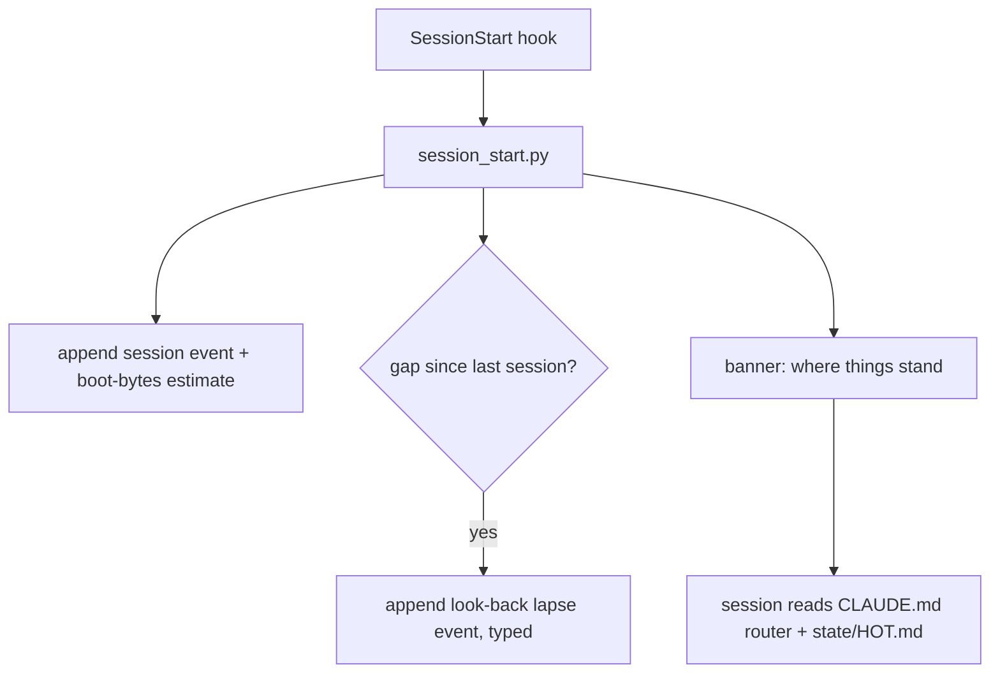
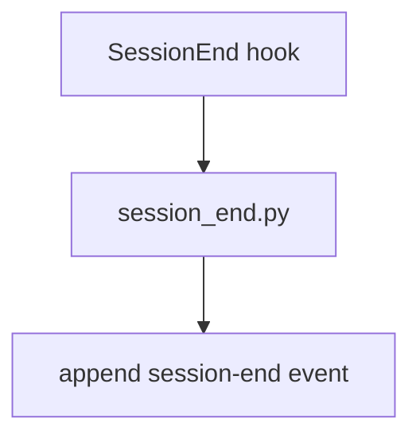
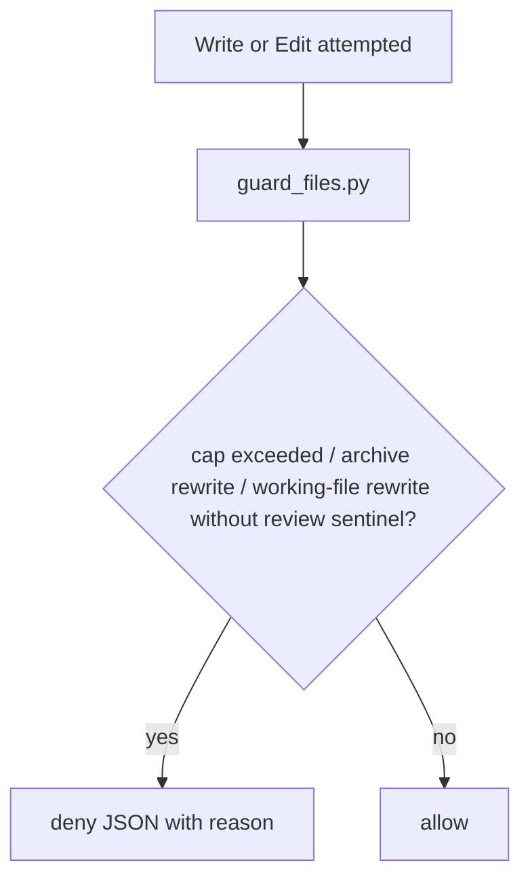
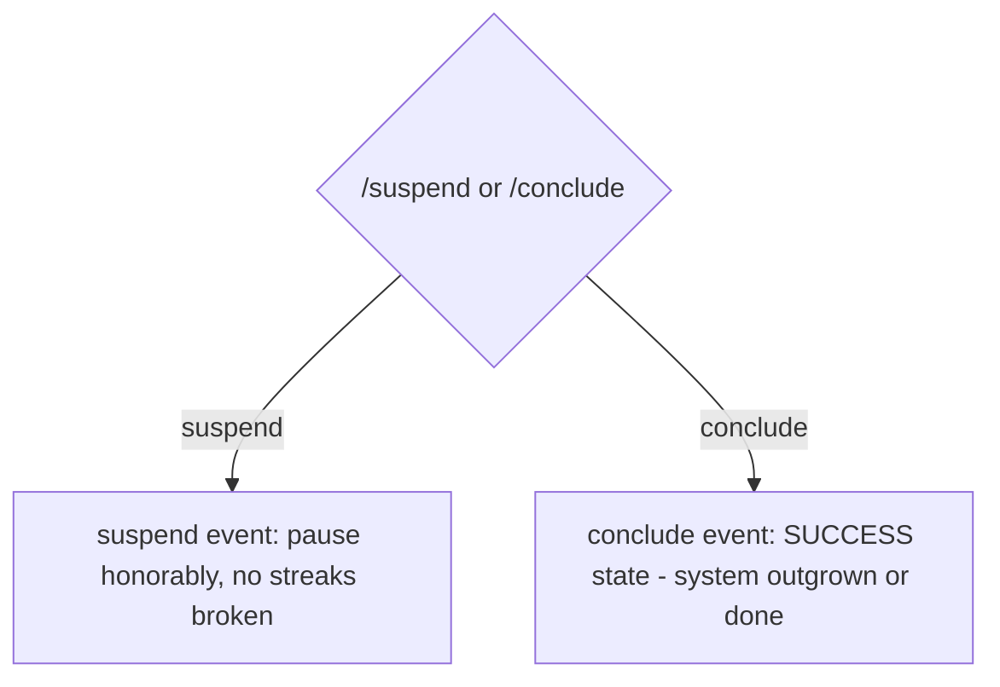

# SP5: SYSTEM-MAP.md Implementation Plan

**Executed — shipped as 0.7.0 (1a07969)**

> **For agentic workers:** REQUIRED SUB-SKILL: Use superpowers:subagent-driven-development (recommended) or superpowers:executing-plans to implement this plan task-by-task. Steps use checkbox (`- [ ]`) syntax for tracking.

**Goal:** `docs/SYSTEM-MAP.md` in every instance — kernel flows from a template at scaffold, instance flows authored at build, drift-checked at audit, updated by the governor, staleness-checked by the validator.

**Architecture:** Spec: `docs/superpowers/specs/2026-07-23-sp5-system-map-design.md`, binding. Branch: `sp5-system-map` (off sp4-audit). Template + scaffold render + one validator check are kernel work (TDD); the rest is skill doctrine.

---

### Task 1: SYSTEM-MAP template + scaffold render

**Files:**
- Create: `templates/instance/SYSTEM-MAP.md.tmpl`
- Modify: `skills/build/scaffold.py`
- Modify: `tests/test_scaffold.py`, `tests/test_templates.py`

- [ ] **Step 1: Failing tests.** Add to `tests/test_scaffold.py`:

```python
def test_system_map_rendered(tmp_path):
    t = scaffold(tmp_path)
    text = (t / "docs" / "SYSTEM-MAP.md").read_text()
    assert "{{" not in text
    assert "study-coach" in text
    assert "Last reconciled:" in text
    for fid in ["session-start", "log-event", "guard-write", "review-cycle"]:
        assert f"## Flow: {fid}" in text, fid
```

Add to `tests/test_templates.py` (match its existing style):

```python
def test_system_map_template_has_kernel_flows():
    text = (REPO / "templates" / "instance" / "SYSTEM-MAP.md.tmpl").read_text()
    assert "Last reconciled: {{today}}" in text
    for fid in ["session-start", "session-end", "log-event", "guard-write",
                "review-cycle", "suspend-conclude", "upgrade"]:
        assert f"## Flow: {fid}" in text, fid
    assert "```mermaid" in text and "Boundary:" in text and "Verification:" in text
```

(If test_templates.py has no `REPO` import, add `from conftest import REPO`.) Run → FAIL.

- [ ] **Step 2: Create `templates/instance/SYSTEM-MAP.md.tmpl`** with exactly this content:

````markdown
<!-- managed-by-cairn: {{cairn_version}} — instance-authored after scaffold; upgrade never overwrites -->
# System map — {{instance_name}}

Last reconciled: {{today}}

One flow per section. This file is the source of truth for what this system DOES — when a
flow changes, this file changes in the same commit (the governor enforces it at review).
Metadata line per flow: Trigger · Writes · Verification · Boundary (act|ask|never).
Telemetry may cite flows: `flow=<id>` on any /log event.

## Flow: session-start — boot
Trigger: SessionStart hook (every session) · Writes: telemetry/events.jsonl · Verification: validate.py at review · Boundary: act



## Flow: session-end — close
Trigger: SessionEnd hook · Writes: telemetry/events.jsonl · Verification: none (append-only log) · Boundary: act



## Flow: log-event — telemetry
Trigger: /log (user or model) · Writes: telemetry/events.jsonl · Verification: jsonl_integrity check at review · Boundary: act

```mermaid
flowchart TD
  A[/log] --> B{intent / outcome / metric / friction?}
  B --> C[cairn_event.py TYPE key=val]
  C --> D[append to telemetry/events.jsonl]
  B -- friction --> E[failure_mode tag: spec verify context overreach tooling upkeep]
```

## Flow: guard-write — file discipline
Trigger: PreToolUse hook on Write/Edit (and Bash via guard_bash.py) · Writes: none (gate only) · Verification: deterministic (P9) · Boundary: act



## Flow: review-cycle — the governor
Trigger: /cairn:review (cadence: review_days) · Writes: state/*, manifest.json, telemetry, this file · Verification: validate.py + user gate on every proposal · Boundary: ask

```mermaid
flowchart TD
  A[/cairn:review] --> B[touch .cairn/review-in-progress]
  B --> C[validate.py: caps, staleness, sweeps]
  C --> D[memory lane: probe -> verify -> repair -> consolidate]
  D --> E[metrics report: north star watched, inputs, guardrails, lapses, failure tags]
  E --> F[proposals: BUILD / PARK / REJECT - user is the gate]
  F --> G[applied BUILDs update files AND this map + stamp]
  G --> H[delete sentinel]
```

## Flow: suspend-conclude — honorable exits
Trigger: /suspend or /conclude · Writes: telemetry/events.jsonl, state/HOT.md · Verification: none · Boundary: ask



## Flow: upgrade — kernel refresh
Trigger: /cairn:upgrade · Writes: .claude/hooks/*, .claude/commands/*, .claude/workflows/*, manifest version · Verification: merge.py never overwrites user-modified files; validate.py after · Boundary: ask

```mermaid
flowchart TD
  A[/cairn:upgrade] --> B[copy hooks + deep-research.js wholesale]
  B --> C[render + merge commands via merge.py]
  C --> D{user-modified?}
  D -- yes --> E[land as .cairn-new, user decides]
  D -- no --> F[replace in place]
  F --> G[bump manifest cairn_version + validate.py]
```

<!-- Instance-specific flows below: the builder appends one section per workflow it designed
     (triggers configured, working-file update paths, agentic runs). Same shape: stable id,
     metadata line, mermaid. -->
````

- [ ] **Step 3: scaffold.py** — in the directory-creation block add `(target / "docs").mkdir()`; with the other template renders add:

```python
    (target / "docs" / "SYSTEM-MAP.md").write_text(
        render((T / "instance" / "SYSTEM-MAP.md.tmpl").read_text(), subs))
```

- [ ] **Step 4:** All tests pass, full suite green. Note: `test_scaffolded_instance_boots_clean` now runs validate.py against an instance WITH a fresh map — must stay silent (Task 2's check treats fresh stamp as fine; until Task 2 lands there is no system_map check at all, also fine).

- [ ] **Step 5: Commit** — `git add templates/instance/SYSTEM-MAP.md.tmpl skills/build/scaffold.py tests/test_scaffold.py tests/test_templates.py && git commit -m "feat(sp5): SYSTEM-MAP.md template with kernel flows + scaffold render"`

---

### Task 2: validate.py system_map staleness check

**Files:**
- Modify: `templates/hooks/validate.py`
- Modify: `tests/test_validate_sweeps.py`

- [ ] **Step 1: Failing tests** (reuse the file's helpers):

```python
def test_system_map_missing_is_silent(instance):
    assert checks(instance, "system_map") == []

def test_system_map_stale_and_fresh(instance):
    (instance / "docs").mkdir(exist_ok=True)
    smap = instance / "docs" / "SYSTEM-MAP.md"
    smap.write_text(f"# map\n\nLast reconciled: {days_ago(100)}\n")
    assert len(checks(instance, "system_map")) == 1          # 100d > 2*30d review cadence
    smap.write_text(f"# map\n\nLast reconciled: {days_ago(10)}\n")
    assert checks(instance, "system_map") == []

def test_system_map_no_stamp_flags(instance):
    (instance / "docs").mkdir(exist_ok=True)
    (instance / "docs" / "SYSTEM-MAP.md").write_text("# map, no stamp\n")
    assert len(checks(instance, "system_map")) == 1
```

- [ ] **Step 2: Implement** in `sweeps()` (same style as the other checks; reuse the existing `STAMP` regex):

```python
    smap = root / "docs" / "SYSTEM-MAP.md"
    if smap.is_file():
        stamp = STAMP.search(smap.read_text())
        limit = 2 * m.get("cadence", {}).get("review_days", 30)
        if not stamp:
            out.append({"check": "system_map", "level": "soft",
                        "file": "docs/SYSTEM-MAP.md", "detail": "no 'Last reconciled:' stamp"})
        else:
            try:
                age = (today - datetime.date.fromisoformat(stamp.group(1))).days
                if age > limit:
                    out.append({"check": "system_map", "level": "soft",
                                "file": "docs/SYSTEM-MAP.md", "age_days": age})
            except ValueError:
                pass
```

- [ ] **Step 3:** Tests pass; full suite green (scaffolded instances have today's stamp → silent).

- [ ] **Step 4: Commit** — `git add templates/hooks/validate.py tests/test_validate_sweeps.py && git commit -m "feat(sp5): system_map staleness check (silent when absent — no legacy nagging)"`

---

### Task 3: Skill wiring — build authors, governor maintains, audit drift-checks

**Files:**
- Modify: `skills/build/SKILL.md`, `skills/review/SKILL.md`, `skills/audit/SKILL.md`, `templates/instance/CLAUDE.md.tmpl`
- Modify: `tests/test_skills_exist.py` (build += ["SYSTEM-MAP"], review += ["SYSTEM-MAP"], audit += ["SYSTEM-MAP", "drift"])

- [ ] **Step 1:** Token test first → FAIL.

- [ ] **Step 2: build SKILL.md** — in the scaffold/finalize stage (where docs/RESEARCH.md is written and the initial commit happens), insert:

```markdown
Before the initial commit, complete `docs/SYSTEM-MAP.md`: the scaffolder rendered the seven
kernel flows; append one section per instance-specific workflow you designed (each
configured trigger, each working-file update path, any agentic runs) — same shape: stable
id, metadata line (Trigger · Writes · Verification · Boundary), mermaid block. A flow whose
Verification field is "none" but whose Writes is not — say so out loud; that gap is a
finding waiting to happen (P16). This file is the system's source of truth: hidden-in-prompts
behavior is exactly what it exists to prevent.
```

- [ ] **Step 3: review SKILL.md** — in Stage 4's application rules, add one bullet:

```markdown
- **The map moves with the system.** An applied BUILD that changes any flow updates the
  matching `docs/SYSTEM-MAP.md` section and its `Last reconciled:` stamp in the same
  application step — a design change without a map update is an incomplete BUILD. If the
  validator flagged `system_map` staleness, reconcile the map against reality during Stage 2.
  If the map is absent entirely (pre-0.7.0 instance), propose creating it ONCE (kernel flows
  + observed instance flows); a REJECT is remembered like any other.
```

- [ ] **Step 4: audit SKILL.md** — in Stage 0, after the AUDIT.md prior-run paragraph, insert:

```markdown
**Map first.** If `docs/SYSTEM-MAP.md` exists, read it and drift-check it against reality:
flows referencing removed skills/hooks, mechanisms present in the repo but missing from the
map — drift is a finding (the map lied). If it does not exist, reconstructing it IS the
audit's first deliverable: walk every entry point (hooks, commands, skills, scheduled jobs)
and write one flow section per workflow (stable id, Trigger · Writes · Verification ·
Boundary metadata line, mermaid block, `Last reconciled:` stamp) BEFORE the doctrine walk —
then the walk cites flow ids, and the map stays with the repo as the source of truth either
way.
```

- [ ] **Step 5: CLAUDE.md.tmpl** — add one line to the owner-map/where-things-live section: `- How this system works (every flow, as mermaid) → docs/SYSTEM-MAP.md` (match surrounding format; verify no render breakage).

- [ ] **Step 6:** Coherence read of all three skills; full suite green.

- [ ] **Step 7: Commit** — `git add skills/build/SKILL.md skills/review/SKILL.md skills/audit/SKILL.md templates/instance/CLAUDE.md.tmpl tests/test_skills_exist.py && git commit -m "feat(sp5): builder authors, governor maintains, audit drift-checks SYSTEM-MAP.md"`

---

### Task 4: 0.7.0 release chores

**Files:** `.claude-plugin/plugin.json` (0.6.0→0.7.0), `CHANGELOG.md`, `README.md` (add `docs/SYSTEM-MAP.md` to the "What you get" tree with a one-phrase comment).

- [ ] **Step 1:** CHANGELOG after `# Changelog`:

```markdown
## 0.7.0 — SYSTEM-MAP.md: the system's flows as a source of truth

- **`docs/SYSTEM-MAP.md`** in every instance — one Mermaid flowchart per workflow with a machine-checkable metadata line (Trigger · Writes · Verification · Boundary) and stable flow ids telemetry can cite (`flow=<id>`). Kernel flows ship pre-authored from a template; the builder appends instance-specific flows before the first commit.
- **Governor maintains it** — an applied BUILD that changes a flow updates the map in the same step; the validator flags staleness (`system_map`, silent when absent — legacy instances get a one-time proposal, never a nag).
- **Audit uses it** — map-first rule: reuse and drift-check an existing SYSTEM-MAP.md (drift is a finding), or reconstruct it as the audit's first deliverable so the doctrine walk cites flow ids.
```

- [ ] **Step 2:** Full suite; end-to-end smoke: scaffold → confirm rendered map (no `{{`, today's stamp, 7 flows) → age the stamp 100 days → validator flags `system_map` → delete the file → validator silent.

- [ ] **Step 3: Commit** — `git add .claude-plugin/plugin.json CHANGELOG.md README.md && git commit -m "feat: 0.7.0 — SYSTEM-MAP.md source-of-truth flows (build/review/audit wired)"`

---

## Verification
1. Full suite green.
2. Smoke per Task 4 Step 2.
3. Read the rendered SYSTEM-MAP.md from a scratch scaffold: every mermaid block syntactically plausible (balanced brackets, valid arrows), metadata lines complete, kernel-flow content matches what the hooks/commands actually do (cross-check guard-write against guard_files.py behavior, review-cycle against review SKILL.md stages).
